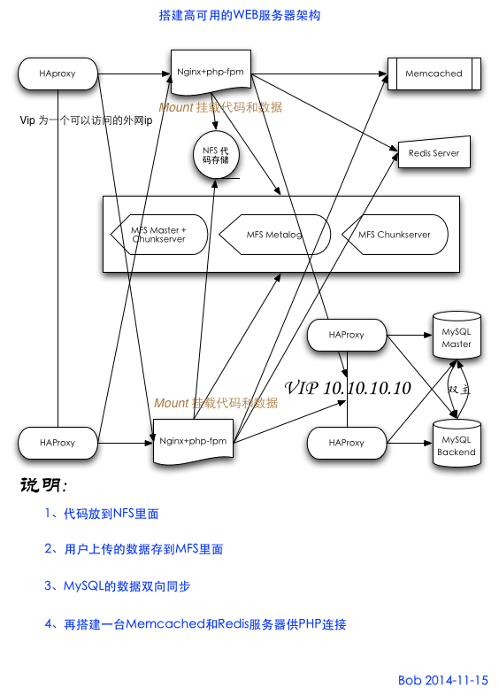

最近工作需要，画了一幅比较典型的高可用 Web 架构图，这中间都是开源产品

所用软件列表：

* HAProxy + Keepalived
* Nginx + php-fpm
* MySQL
* NFS
* MooseFS
* Redis
* Memcached

学习和使用这些软件就可以搭建一套非常棒的 Web 架构了，目前只有 NFS 是单点，因为其它的网络文件系统，通过测试发现性能都比不上 NFS ，所以这一层还是个单点，但是可以做 Lsyncd + Rsyncd 来做文件备份同步。
