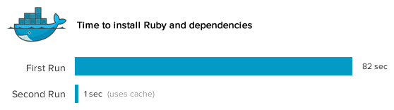
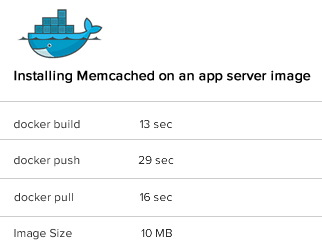

本文翻译自：《[Docker: Git for deployment -- Scout](http://blog.scoutapp.com/articles/2013/08/28/docker-git-for-deployment)》，个人感觉它的内容和标题不对，所以就没有直译过来，要是我理解错了请帮忙纠正。

我听说了 `Docker` 多么令人惊叹，但是它并没有征服我的心，直到我提出一个实际的问题：【如果 Scout 使用 Docker 来部署，它会让我们的部署变得更顺利吗？】

以下是三个案例：

### 高效地模拟线上环境

我们线上有 16 台服务器，如果我尝试在本地使用 `VirtualBox` 配置每个实例 512 MB内存，那么它将占用我笔记本的两倍内存（说明他笔记本只有 4G 内存），`VirtualBox` 需要有许多多余的开支来管理每个子操作系统，`Docker` 在这方面是不一样的——容器共享同一个操作系统，更有可能是同样的二进制包文件和库文件，它可以运行在一台 `Docker` 主机上运行好几百个容器。

#### 老方法

我不能在本地完全地模拟线上环境，让我们来看一下通过 `Vagrant` 启动一台机器需要花多久：

~~~
$ time vagrant up
Bringing machine 'default' up with 'virtualbox' provider...
[default] Importing base box 'squeeze64-ruby193'...
...
[default] Booting VM...
[default] Waiting for VM to boot. This can take a few minutes.
...

real  1m32.052s
~~~

启动一个镜像需要一分半钟，如果我需要修改一个配置文件并检测是否能够正常工作，那么需要重启镜像，那又是可怕的一分半钟。

如果你配置的有错，那将是一个残忍的惩罚。（每次修改就需要一分半钟才能看到结果）

使用 `Docker` 后

能想像 `Docker` 有多轻便吗？当你在 `Docker` 容器里面运行程序，你甚至可能不会注意到他们不是直接在主机上运行的，在下面的例子中，我从标记的 "rails" 镜像中启动一个 `Docker` 容器来运行 Rails 应用（Dockerfile）：

~~~
root@precise64:~# docker run rails
2013-08-26 20:21:14,600 CRIT Supervisor running as root (no user in config file)
2013-08-26 20:21:14,603 WARN Included extra file "/srv/docker-rails/Supervisorfile" during parsing
2013-08-26 20:21:14,736 INFO RPC interface 'supervisor' initialized
2013-08-26 20:21:14,740 CRIT Server 'unix_http_server' running without any HTTP authentication checking
2013-08-26 20:21:14,754 INFO supervisord started with pid 1
2013-08-26 20:21:15,783 INFO spawned: 'rails' with pid 10
2013-08-26 20:21:16,841 INFO success: rails entered RUNNING state, process has stayed up for > than 1 seconds (startsecs)
~~~

只需要两秒钟就完成了容器的启动和 supervisor 的启动（用来启动 Rails 应用的管理程序）

总之，`Docker` 能够让你在测试机上完全地模拟线上环境，它是如此的简单，让我可以真正地进行全站测试了。

### 更简单快速地创建镜像

#### 传统方法

如果你用脚本从一个基本的镜像创建一个虚拟机镜像（例如：在 `Ubuntu` 上创建 `Rails stack`），若想把这个都做的正确是非常痛苦的，除非你经常的在做这个，看看安装 `Ruby` 依赖的一些信息吧：

~~~
$ time apt-get install -y -q ruby1.9.1 ruby1.9.1-dev rubygems1.9.1 irb1.9.1 build-essential libopenssl-ruby1.9.1 libssl-dev zlib1g-dev
Reading package lists...
Building dependency tree...
The following extra packages will be installed:
....
Setting up libalgorithm-merge-perl (0.08-2) ...
Processing triggers for libc-bin ...
ldconfig deferred processing now taking place

real 1m22.470s
~~~

然后，尝试去安装 `NodeJS` 的依赖，但是你忘记了添加 Node 到 apt 库中

~~~
$apt-get install -y nodejs
...
E: Unable to locate package nodejs
~~~

等你把这个问题解决了，想在新的基本镜像上运行你的脚本。
你需要重新安装 `Ruby`，还需要在安装 `Node` 之前，忍受不必要的 82 秒时间，真是痛苦至极。

使用 `Docker` 的方式

把创建镜像的步骤写入到 `Dockerfile` 文件中，看懂 `Dockerfile` 非常容易，因为里面就是你输入的命令，第一次安装 `Ruby` 不会比其它方式快，但是请看我们再次通过 `Dockerfile` 创建一个镜像：

~~~
FROM ubuntu:12.04
RUN apt-get update

## MYSQL
RUN apt-get install -y -q mysql-client libmysqlclient-dev

## RUBY
RUN apt-get install -y -q ruby1.9.1 ruby1.9.1-dev rubygems1.9.1 irb1.9.1 build-essential libopenssl-ruby1.9.1 libssl-dev zlib1g-dev
~~~

~~~
root@precise64:/# time docker build -t="dlite/appserver" .
Uploading context 92160 bytes
Step 1 : FROM ubuntu:12.04
 ---> 8dbd9e392a96
Step 2 : RUN apt-get update
 ---> Using cache
 ---> b55e9ee7b959
Step 3 : RUN apt-get install -y -q mysql-client libmysqlclient-dev
 ---> Using cache
 ---> dc92be6158b0
Step 4 : RUN apt-get install -y -q ruby1.9.1 ruby1.9.1-dev rubygems1.9.1 irb1.9.1 build-essential libopenssl-ruby1.9.1 libssl-dev zlib1g-dev
 ---> Using cache
 ---> 7038022227c0
Successfully built 7038022227c0

real    0m0.848s
~~~

哇哦，为什么安装 `Ruby` 连一秒都不到？ 看那些 Keys (例如：dc92be6158b0 )，`Docker` 不会重新运行 `Dockerfile` 中的每一行命令，会检查那是不是已经运行过的命令，是的话直接从缓存中取回对文件的修改。
做的如此神奇，是因为 `Docker` 使用了 `AuFS` 文件系统（union file system）

总之，`Docker` 让我们反复地创建一个镜像不再那么痛苦，对于已经成功的后面就不需要再等了。I'm not perfect and Docker doesn't punish me when I make mistakes.

### 部署镜像，不更新基础设施

传统的做法

[Scout](https://scoutapp.com/)和其它部署一样，很长的时间在运行虚拟机，使用 `Puppet` 来更新所有的基础设施，但是经常会非常的痛苦。

如果我们部署更新到我们的栈，`Puppet` 会在每台虚拟机运行更新，这会花去许多的时间——即使是一个小小的改变，`Puppet` 需要检查所其它所有的都检查一遍。在部署的时间会出问题：如果我们安装 `Memcached` 时网络有点问题，`apt-get install memcached` 就会执行失败。

回滚到主要的改变通过不会像我们想像的那么平稳，（例如更新 `Ruby` 的版本）
这些总是并不是 `Puppet` 的问题， `Puppet` 和 `Chef` 是一个工具，当你要在一直运行的多台虚拟机上运行命令时，它会给你到多台机器上去运行，可以节省许多时间。

`Docker` 的做法

部署镜像——不修改已经存在的虚拟机，你会 100% 有确定在本地可以运行的，在生产环境也能运行。

镜像非常地大是吗？在 `Docker` 上不是这样的，请记住容器不会运行在宿主机上，它使用 union file system，当我们改变一个镜像，我们只需要新的一层。（说的好高大上，完全听不懂，后面可以看看 union file system 为何如此强大）

例如，在应用服务器上安装 `Memcached`，创建一个新的镜像，然后给它打上一个 `tag` 叫 `dlite/appserver-memcached`，它是基于 `dlite/appserver` 这个镜像的，dlite 是我在 index.docker.io 上的用户名。

~~~
root@precise64:/# time docker build -t="dlite/appserver-memcached" .
Uploading context 92160 bytes
Step 1 : FROM appserver
 ---> 8dbd9e392a96
Step 2 : RUN apt-get update
 ---> Using cache
 ---> b55e9ee7b959
Step 3 : RUN apt-get install -y -q memcached
 ---> Running in 2a2a689daee3
Reading package lists...
Building dependency tree...
...
Starting memcached: memcached.
Processing triggers for libc-bin ...
ldconfig deferred processing now taking place
 ---> 2a2a689daee3
Successfully built 2a2a689daee3

real    0m13.289s
user    0m0.132s
sys 0m0.376s
~~~

只用了 13 秒就安装好了 `Memcached`，`Dockerfile` 在执行时会优先使用已经安装成功的缓存，这个速度我喜欢。。。

把刚才的操作提交到仓库

~~~
root@precise64:/# time docker push dlite/appserver-memcached
The push refers to a repository [dlite/appserver-memcached] (len: 1)
Processing checksums
Sending image list
Pushing repository dlite/appserver-memcached (1 tags)
Pushing 8dbd9e392a964056420e5d58ca5cc376ef18e2de93b5cc90e868a1bbc8318c1c
Image 8dbd9e392a964056420e5d58ca5cc376ef18e2de93b5cc90e868a1bbc8318c1c already pushed, skipping
...
Pushing tags for rev [ad8f8a3809afcf0e2cff1af93a8c29275a847609b05b20f7b6d2a5cbd32ff0d8] on {https://registry-1.docker.io/v1/repositories/dlite/appserver-memcached/tags/latest}

real    0m28.710s
~~~

在线上服务器把镜像下载下来

~~~
root@prod:/# time docker pull dlite/appserver-memcached
Pulling repository dlite/appserver-memcached
Pulling image ad8f8a3809afcf0e2cff1af93a8c29275a847609b05b20f7b6d2a5cbd32ff0d8 (latest) from dlite/appserver-memcached

real    0m15.749s
~~~

只用了 15 秒就把 `dlite/appserver-memached` 镜像下载下来了，镜像只有 10 MB 它使用 appserver 为基础镜像。

~~~
root@precise64:~# docker images
REPOSITORY            TAG                 ID                  CREATED             SIZE
appserver             latest              7038022227c0        3 days ago          78.66 MB (virtual 427.9 MB)
appserver-memcached   latest              77dc850dcccc        16 minutes ago      10.19 MB (virtual 438.1 MB)
~~~

我们不需要下载全部的镜像，只需要下载添加 `Memcached` 的改变就可以了。

大多数情况下，我们的修改非常的小，所以下载一个新的镜像会非常地快。

启动一个新的 `Docker` 容器很快，上传和下载一个新的镜像也很轻量。

与其在现有的虚拟机上弄的乱七八糟，不如启动一个新的容器，然后把旧的容器删除就好了。

令人情奇的（Mind blown!）
它意味着我们不需要去担心统一性，我们不会去修改现有的虚拟机，只是启动一个新的容器。那也意味着回滚也就是轻而易举的事！`Memcached` 挂了？直接停止使用 `dlite/appserver-memcached` 然后启动 `dlite/appserver-memcached` 的容器就好了。

### 不足之处

生态还不是很完善，对于分布式配置 / 协调和服务发现没有好的解决方案（那是博文以前，现在应该很不一样了，可参考：《[腾讯Gaia：万台规模的Docker应用实践](http://blog.sina.cn/dpool/blog/s/blog_ea790d9d0102w7rw.html?vt=4&wm=3164_0001&tt_group_id=4092136568)）》

我们如何做到新应用服务窗口启动了，自动更改 `HAProxy` 的 配置文件？

新的数据库容器启动了，应用服务器如何自动与数据库容器通信？

如何让不同主机的 `Docker` 窗口通信？

即将到来的 Flynn.io 将会解决这些问题，上面的问题将不再是问题（现在这些总是早就不是问题了， Docker 的生态圈已经非常完善，国内 [DaoCloud](https://www.daocloud.io/) 在这方面就是领头羊，正在使用它的加速。）

### Docker 可以像 Git 一样部署

创建一个项目的时候，开发者可以去使用 `Git` 来提升性能和灵活性。 `Git` 鼓励实验新的东西，并且在你做错了不会给你带来很多的麻烦事：在一个分支去做你的实验，如果做遭了，只需要 `git rebase` 或 `git reset`， Git 可以很简单地就创建一个分支和推送一个分支。

`Docker` 鼓励实验操作，容器启动非常地快，创建一个镜像更是非常地快，使用别的镜像做为基本镜像也非常的容易，部署更个镜像非常地快，最后但同样重要的是，回滚也非常地方便。

快速 + 灵活 = 部署将会更快乐
