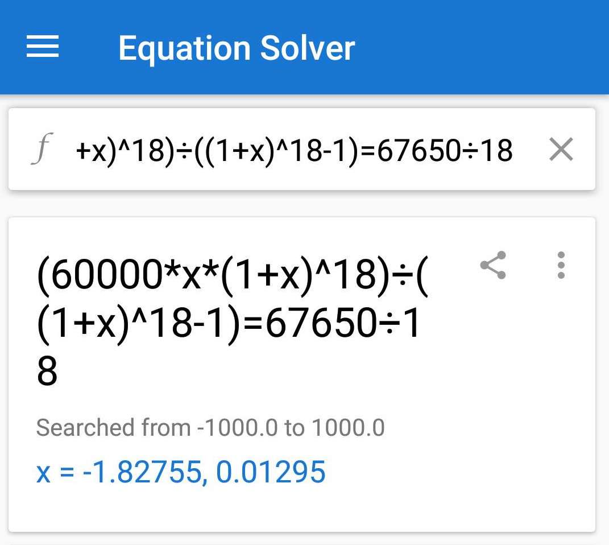

以前并未完全了解银行贷款的年利率的计算规则，前两天在 Youtube 上看了李永乐老师讲的[《贷款买房，利息怎么算？》](https://www.youtube.com/watch?v=T6FBfNpiBYw)，才明白利息的计算方法。

## 贷款的还款方式

银行贷款的还款方式有两种：1. 等额本金 2. 等额本息

### 等额本金

等额本金又称利随本清、等本不等息还款法。贷款人将本金分摊到每个月内，同时付清上一交易日至本次还款日之间的利息。

这种还款方式相对等额本息而言，总的利息支出较低，但是前期支付的本金和利息较多，还款负担逐月递减。

计算公式：

$$ 月利率 = \frac{年利率}{12} $$

$$ 每月本金 = \frac{总本金}{贷款月数} $$
$$ 累计已还本金 = 每月本金 x 还款月数 $$
$$ 剩余本金 = 总本金 - 累计已还本金 $$

$$ 每月利息 = 剩余本金 × 月利率 $$
$$ 每月还本付息(还款)金额 = 每月本金 + 每月利息 $$

$$ 还款总利息 =\frac{(贷款月数 + 1)x贷款额x月利率}{　　　　　　　　　2　　　　　　　　}$$
$$ 还款总额 =   还款总利息 + 贷款额 $$

假设贷款 10 万元，年利率为 6%，贷款时间为 12 个月，则：

	月利率 = 0.06 / 12 = 0.005
    每月本金 = 100000 / 12 = 8333.333333333
    还款总利息 = (12 + 1) * 100000 * 0.005 / 2 = 3250
    还款总额 =  3250 + 100000 = 103250

### 等额本息

等额本息又称为定期付息，即借款人每月按相等的金额偿还贷款本息，其中每月贷款利息按月初剩余贷款本金计算并逐月结清。

由于每月的还款额相等，因此，在贷款初期每月的还款中，剔除按月结清的利息后，所还的贷款本金就较少；而在贷款后期因贷款本金不断减少、每月的还款额中贷款利息也不断减少，每月所还的贷款本金就较多。

计算公式：

$$ 月利率 = \frac{年利率}{ 12} $$

$$ 每月还款额 = \frac{总本金 × 月利率 × (1 + 月利率) ^ {贷款月数}}{ (1+月利率) ^ {贷款月数}-1}  $$

$$ 还款总利息 = 每月还款额 x 贷款月数 - 总本金 $$

$$ 还款总额 = 每月还款额 x 贷款月数 $$

假设贷款 10 万元，年利率为 6%，贷款时间为 12 个月，则：

	月利率 = 0.06 / 12 = 0.005
    每月还款额 = ( 100000 * 0.005 * ( 1 + 0.005) ^ 12) / (( 1 + 0.005) ^ 12 -1 )
            = 8606.642970708
    还款总利息 = 8606.642970708 * 12 - 100000 = 3279.715648496
    还款总额 =  3279.715648496 + 100000 = 103279.715648496

## 招商银行 E 招贷

从去年年中开始 E 招贷就开始给我打电话说：“您被评为优质客户，可以贷款 8 万元，直接打到卡里”，一直在拒绝，直到今年年初，因为房子要装修了，钱不太够，本能的我应该是找亲戚朋友借的，但想到还要麻烦人家，我直接借 E 招贷多方便啊。

2018 年 1 月通过 E 招贷贷款了 6 万元，分了 18 期，每期手续费为 450 元，免 1 个月手续费。

    每月还款本金 = 60000 / 18 = 3333.33
    第一个月需要还 3333.33
    后面 17 个月，每个月还 3333.33 + 450 = 3783.33
    总利息 = 17 * 450 = 7650
    总还款额 = 17 * 450 + 60000 = 67650

#### 那么 E 招贷的年利率是多少呢？

##### 等额本金

        设月利率为 A

        ( (18 + 1) * 60000 * A ) / 2 = 7650
        A = (2 * 7650) / ( ( 18 + 1 ) * 60000)
        A = .013421053

        年利率 = 12 A = 12 * .013421053 = 0.161052636 = 16.1%

##### 等额本息

        设月利率为 A

        60000 * A * (1 + A)^18 / ((1+A)^18 - 1) = 67650 /  18
        A =  0.01295
        年利率 = 12 A  = 12 * 0.01295 = 0.1554 = 15.54%

用 《[Equation Solver](https://play.google.com/store/apps/details?id=com.alago.eqnlite&hl=en_US)》求解：

