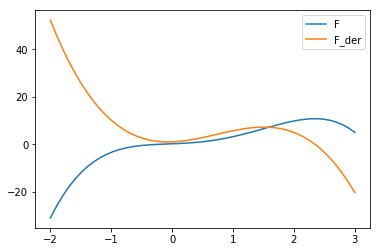

## 简介

高中你就会接触到**多项式**和**多项式函数**，本章教程完全依赖多项式，也就是说，我们将会花一节课的时间去了解多项式。下面是一个 4 次多项式的例子：

$$ p(x) = x^4 - 4 \cdot x^2 + 3 \cdot x $$

你会发觉它们跟整数有许多相似之处，本课我们将会定义多种多项式的算术操作，我们的 Polynomial 类也将提供计算多项式的推导和积分的方法，绘制多项式的图像。

多项式非常漂亮，现在最重要的是如何用 Python 类来实现它们，我们要感谢 [Drew Shanon](http://drewshannon.ca/)，他让我们使用他的精美的图片，将数学视为艺术！

## 数学知识介绍

我们将只会处理含有一个未知数的多项式，含有一个未知数的多项式的一般形式如下：

$$ a_n \cdot x^n + a_{n-1} \cdot x^{n-1} + ... + a_1 \cdot x + a_0 $$

\\( a_0, a_1, ... a_n \\) 为常数，\\( x \\) 为未知数，未知数也就是它没有一个特定的值，可以用任何数都可以用来替换。

这个表达式经常用求和符号来表示：

$$ \sum_{k=0}^{n}a_k \cdot x^k =  a_n \cdot x^n + a_{n-1} \cdot x^{n-1} + ... + a_1 \cdot x + a_0 $$

一个多项式函数，可以用来求多项式的值，一个名为 `f` 的函数含有一个参数，定义如下：

$$ f(x)= \sum_{k=0}^{n}a_k \cdot x^k $$

## 多项式函数与 Python

Python 可以很轻松的实现一个多项式函数，作为一个例子我们定义一个在简介所提到的多项式函数： \\( p(x) = x^4 - 4 \cdot x^2 + 3 \cdot x \\)，该多项式的 Python 代码如下：

~~~python
def p(x):
    return x**4 - 4*x**2 + 3*x
~~~

我们可以在任何其它函数里面调用这个函数：

~~~python
for x in [-1, 0, 2, 3.4]:
    print(x, p(x))
~~~

~~~
# output
-1 -6
0 0
2 6
3.4 97.59359999999998
~~~

~~~python
import numpy as np
import matplotlib.pyplot as plt

X = np.linspace(-3, 3, 50, endpoint=True)
F = p(X)

plt.plot(X,F)
plt.show()
~~~

~~~
# output
<Figure size 640x480 with 1 Axes>
~~~

## Polynomial 类

现在我们将给多项式函数定义一个新的类，我们将会基于我们在 Python 教程 decorators 一章的概念构建，引入一个多项式工厂。

多项式是由系数来决定的，这意味着一个多项式类的实例需要一个列表来定义这些系数。

~~~python
class Polynomial:

    def __init__(self, *coefficients):
        """ input: coefficients are in the form a_n, ...a_1, a_0
        """
        # for reasons of efficiency we save the coefficients in reverse order,
        # i.e. a_0, a_1, ... a_n
        self.coefficients = coefficients[::-1] # tuple is also turned into list

    def __repr__(self):
        """
        method to return the canonical string representation
        of a polynomial.

        """
        # The internal representation is in reverse order,
        # so we have to reverse the list
        return "Polynomial" + str(self.coefficients[::-1])
~~~

我们可以像这样实例化**前面例子多项式函数** <small> \\(\ p(x) = x^4 - 4 \cdot x^2 + 3 \cdot x \\)</small> 的多项式：

~~~python
p = Polynomial(4, 0, -4, 3,  0)
print(p)
~~~

~~~python
# output
Polynomial(4, 0, -4, 3, 0)
~~~
到现在我们已经定义了多项式，但我们需要的是多项式函数，为此我们给 Polynomial 类实例定义方法使其可以被调用：

~~~python
class Polynomial:

    def __init__(self, *coefficients):
        """ input: coefficients are in the form a_n, ...a_1, a_0
        """
        # for reasons of efficiency we save the coefficients in reverse order,
        # i.e. a_0, a_1, ... a_n
        self.coefficients = coefficients[::-1] # tuple is also turned into list

    def __repr__(self):
        """
        method to return the canonical string representation
        of a polynomial.

        """
        # The internal representation is in reverse order,
        # so we have to reverse the list
        return "Polynomial" + str(self.coefficients[::-1])

    def __call__(self, x):
        res = 0
        for index, coeff in enumerate(self.coefficients):
            res += coeff * x** index
        return res
~~~
现在我们可以传入参数来调用实例了，这就是说实例的行为与多项式函数的行为很像。

~~~python
p = Polynomial(4, 0, -4, 3, 0)
for x in range(-3, 3):
    print(x, p(x))
~~~

~~~python
-3 279
-2 42
-1 -3
0 0
1 3
2 54
~~~

~~~python
import matplotlib.pyplot as plt

X = np.linspace(-3, 3, 50, endpoint=True)
F = p(X)

plt.plot(X,F)
plt.show()
~~~

还可以定义多项式的加法和减法，我们需要做的就是对两个多项式的相同指数的系数做加法或减法。

若有以下多项式函数

$$ f(x) = \sum_{k=0}^{n}a_k \cdot x^k $$

和

$$ g(x) = \sum_{k=0}^{n}b_k \cdot x^k $$

加法的定义如下:

$$ (f + g)(x) = \sum_{k=0}^{n}(a_k + b_k) \cdot x^k  $$

相应的减法就是

$$ (f - g)(x) = \sum_{k=0}^{n}(a_k - b_k) \cdot x^k  $$

在我们添加 __add__ 和 __sub__ 之前，需要添加一个生成器 `zip_longest()`，它和 `zip()` 方法一样，将两个参数打包成一个无组，返回列表长度与最长的传入迭代器一致，不够的将会用 `fillchar` 来代替。

~~~python
def zip_longest(iter1, iter2, fillchar=None):

    for i in range(max(len(iter1), len(iter2))):
        if i >= len(iter1):
            yield (fillchar, iter2[i])
        elif i >= len(iter2):
            yield (iter1[i], fillchar)
        else:
            yield (iter1[i], iter2[i])
        i += 1
p1 = (2,)
p2 = (-1, 4, 5)
for x in zip_longest(p1, p2, fillchar=0):
    print(x)
~~~

~~~python
# output
(2, -1)
(0, 4)
(0, 5)
~~~

把该生成器作为一个静态方法添加到 Polynomial 类里面，就可以添加 __add__ 和 __sub__ 方法了

~~~python
import numpy as np
import matplotlib.pyplot as plt
class Polynomial:

    def __init__(self, *coefficients):
        """ input: coefficients are in the form a_n, ...a_1, a_0
        """
        # for reasons of efficiency we save the coefficients in reverse order,
        # i.e. a_0, a_1, ... a_n
        self.coefficients = coefficients[::-1] # tuple is also turned into list

    def __repr__(self):
        """
        method to return the canonical string representation
        of a polynomial.

        """
        # The internal representation is in reverse order,
        # so we have to reverse the list
        return "Polynomial" + str(self.coefficients[::-1])

    def __call__(self, x):
        res = 0
        for index, coeff in enumerate(self.coefficients):
            res += coeff * x** index
        return res

    def degree(self):
        return len(self.coefficients)

    @staticmethod
    def zip_longest(iter1, iter2, fillchar=None):
        for i in range(max(len(iter1), len(iter2))):
            if i >= len(iter1):
                yield (fillchar, iter2[i])
            elif i >= len(iter2):
                yield (iter1[i], fillchar)
            else:
                yield (iter1[i], iter2[i])
            i += 1

    def __add__(self, other):
        c1 = self.coefficients
        c2 = other.coefficients
        res = [sum(t) for t in Polynomial.zip_longest(c1, c2)]
        return Polynomial(*res)

    def __sub__(self, other):
        c1 = self.coefficients
        c2 = other.coefficients

        res = [t1-t2 for t1, t2 in Polynomial.zip_longest(c1, c2)]
        return Polynomial(*res)

p1 = Polynomial(4, 0, -4, 3, 0)
p2 = Polynomial(-0.8, 2.3, 0.5, 1, 0.2)
p_sum = p1 + p2
p_diff = p1 - p2
X = np.linspace(-3, 3, 50, endpoint=True)
F1 = p1(X)
F2 = p2(X)
F_sum = p_sum(X)
F_diff = p_diff(X)
plt.plot(X, F1, label="F1")
plt.plot(X, F2, label="F2")
plt.plot(X, F_sum, label="F_sum")
plt.plot(X, F_diff, label="F_diff")
plt.legend()
plt.show()
~~~

添加求微分到 Polynomial 类非常简单，数学的定义如下：

$$ f'(x) = \sum_{k=0}^{n}k \cdot a_k \cdot x^{k-1}  $$

若

$$ f(x) = \sum_{k=0}^{n}a_k \cdot x^k  $$

添加一个 `derivative` 方法就能实现这个功能：

~~~python
import numpy as np
import matplotlib.pyplot as plt
class Polynomial:

    def __init__(self, *coefficients):
        """ input: coefficients are in the form a_n, ...a_1, a_0
        """
        # for reasons of efficiency we save the coefficients in reverse order,
        # i.e. a_0, a_1, ... a_n
        self.coefficients = coefficients[::-1] # tuple is also turned into list

    def __repr__(self):
        """
        method to return the canonical string representation
        of a polynomial.

        """
        # The internal representation is in reverse order,
        # so we have to reverse the list
        return "Polynomial" + str(self.coefficients[::-1])

    def __call__(self, x):
        res = 0
        for index, coeff in enumerate(self.coefficients):
            res += coeff * x** index
        return res

    def degree(self):
        return len(self.coefficients)

    @staticmethod
    def zip_longest(iter1, iter2, fillchar=None):
        for i in range(max(len(iter1), len(iter2))):
            if i >= len(iter1):
                yield (fillchar, iter2[i])
            elif i >= len(iter2):
                yield (iter1[i], fillchar)
            else:
                yield (iter1[i], iter2[i])
            i += 1

    def __add__(self, other):
        c1 = self.coefficients
        c2 = other.coefficients
        res = [sum(t) for t in Polynomial.zip_longest(c1, c2, 0)]
        return Polynomial(*res[::-1])

    def __sub__(self, other):
        c1 = self.coefficients
        c2 = other.coefficients
        res = [t1-t2 for t1, t2 in Polynomial.zip_longest(c1, c2, 0)]
        return Polynomial(*res[::-1])

    def derivative(self):
        derived_coeffs = []
        exponent = 1
        for i in range(1, len(self.coefficients)):
            derived_coeffs.append(self.coefficients[i] * exponent)
            exponent += 1
        return Polynomial(*derived_coeffs[::-1])

    def __str__(self):
        res = ""
        for i in range(len(self.coefficients)-1, -1, -1):
            res +=  str(self.coefficients[i]) + "x^" + str(i) + " + "
        if res.endswith(" + "):
            res = res[:-3]
        return res

p = Polynomial(-0.8, 2.3, 0.5, 1, 0.2)
p_der = p.derivative()
X = np.linspace(-2, 3, 50, endpoint=True)
F = p(X)
F_derivative = p_der(X)
plt.plot(X, F, label="F")
plt.plot(X, F_derivative, label="F_der")
plt.legend()
plt.show()
~~~

再来几组：

~~~python
p = Polynomial(1, 1, 1, 1, 1)
p2 = Polynomial(1, 2, 3)
p_der = p.derivative()
print(p)
print(p_der)
print(p2)
p3 = p + p2
print(p3)
~~~

~~~python
# output
1x^4 + 1x^3 + 1x^2 + 1x^1 + 1x^0
4x^3 + 3x^2 + 2x^1 + 1x^0
1x^2 + 2x^1 + 3x^0
1x^4 + 1x^3 + 2x^2 + 3x^1 + 4x^0
~~~

[原文链接](https://www.python-course.eu/polynomial_class_in_python.php)
