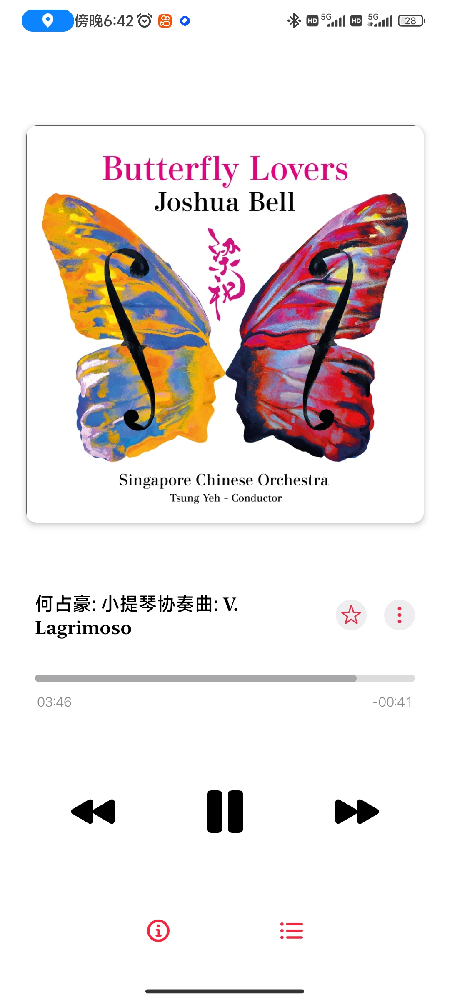
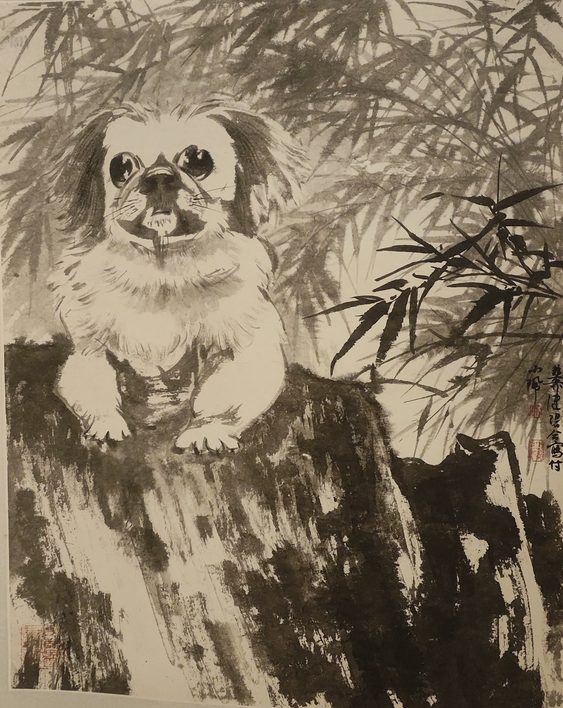
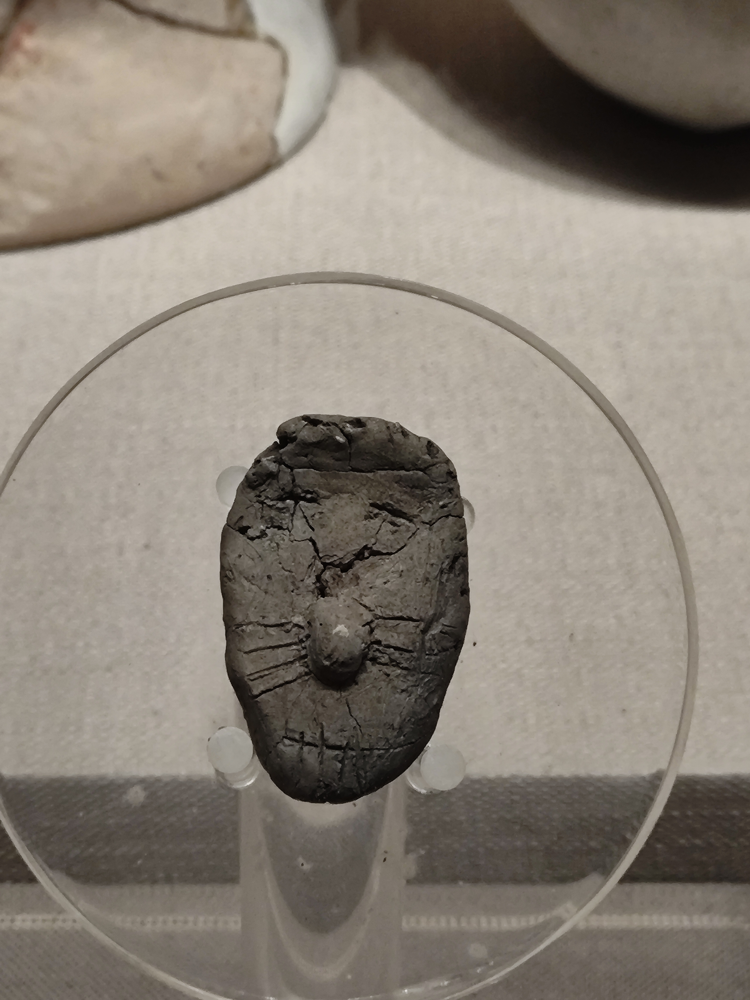
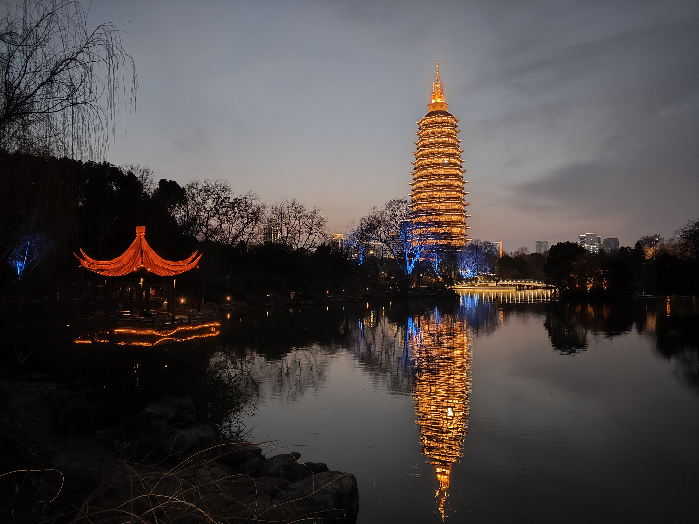

活捉一只变异野生恐龙~

2024 甲辰龙年英语为 Loong Year，弃用 Dragon 因为它与中国的龙完全不是一个物种且含义也不同。西方的龙代表着贪婪与邪恶；中国的龙与之相反代表着好运、高贵、丰收。

动车上看完了一直心心念念的梁祝

最近一周循环播放的音乐：上音何占豪作曲梁祝 时长 27min

常州文化广场，造型别致，让我想起来北京望京SOHO的时光

谢稚柳、陈佩秋《竹石灵犬图轴》 纸本水墨

泥塑人脸

魏晋南北朝时期是家具高度变化的时期，此前家具低矮，人们以跪坐为主，之后为高足，与现代的家具几乎无异

口腔卫生要注意，今年与妈妈一起看红楼梦，剧里面吃完饭漱口，这个习惯我们也跟着学，并保留下来了，图片最右边为**钵盂**盛净水用于漱口，然后吐到中间的**唾盂**中

现代手枪可能借鉴了**弩机**

夜幕中的亭台、天宁寺及其水波中的倒影
