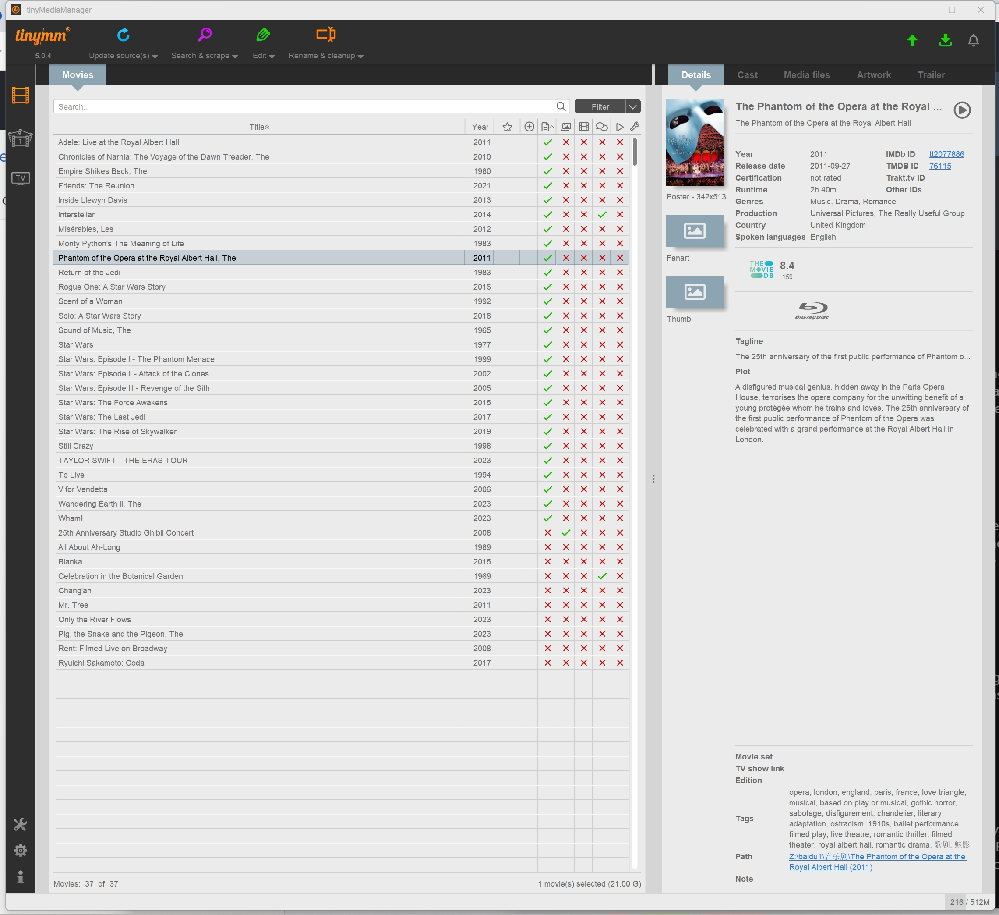
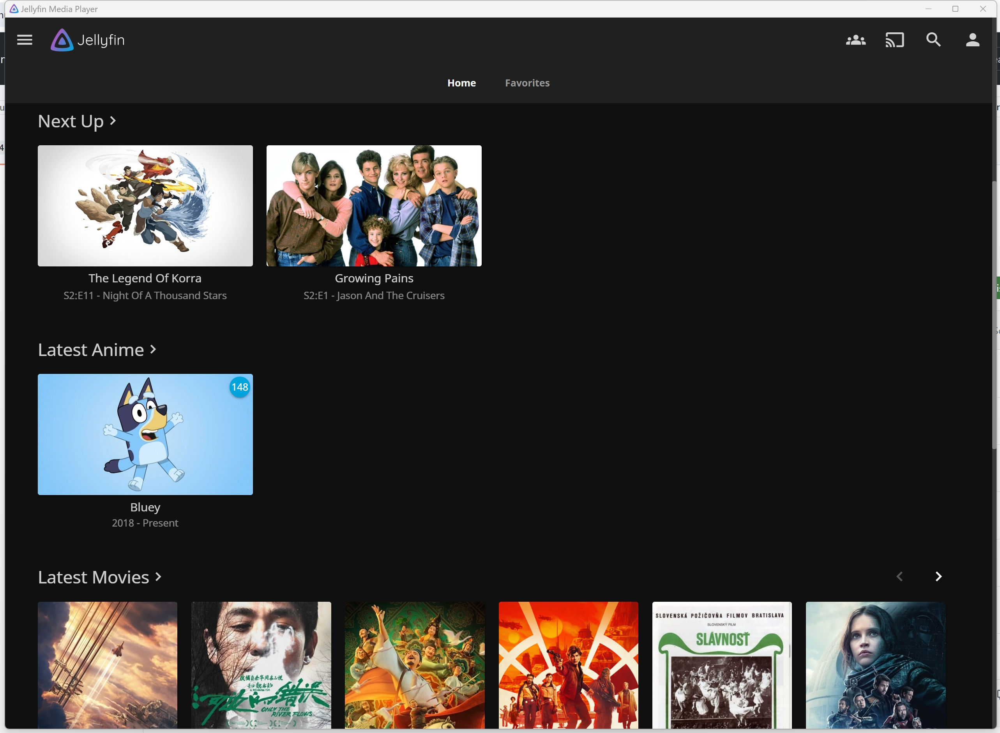
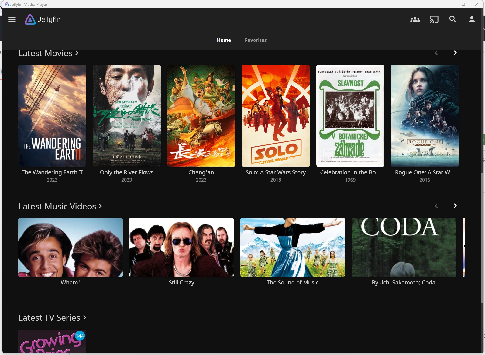
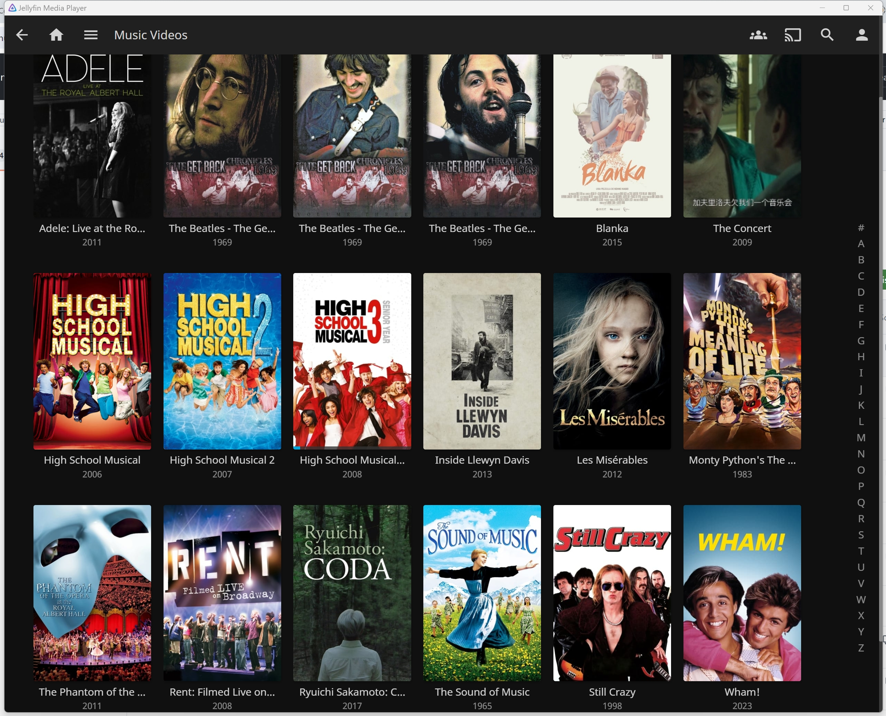
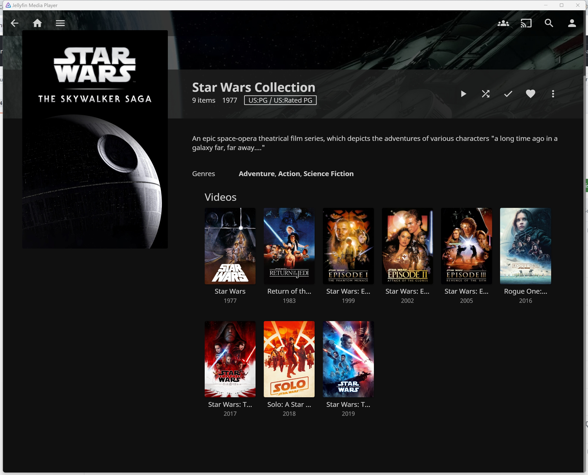
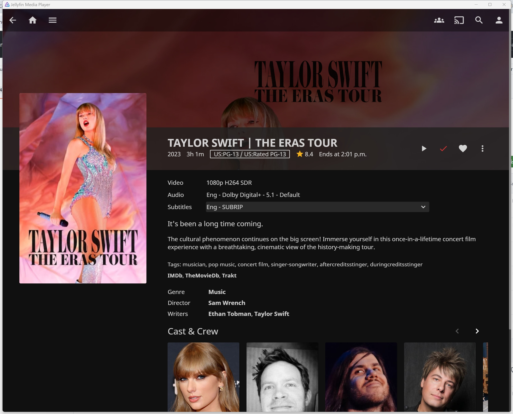

分享使用 OpenWRT + Alist(百度网盘) + Jellyfin + TinyMediaManager 打造的私人影院，这不是一个 step-by-step 的教程，而是一些 Gist + 成果展示的分享，更多搭建过程参考结尾的[#参考文章](#参考文章)

#### Windows 挂载 Alist webdav 到本地盘符，给 TMM 搜刮

修改注册表 `HKEY_LOCAL_MACHINE\SYSTEM\CurrentControlSet\Services\WebClient\Parameters` 把 `BasicAuthLevel` 设置为 2

- 0 = Basic authentication is disabled
- 1 = Basic authentication is enabled for SSL web sites only
- 2 = Basic authentication is enabled for SSL and non-SSL web sites	

```bash
windows powershell $ net stop webclient
windows powershell $ net start webclient
windows powershell $ net use Z: http://192.168.1.1@5244/dav
```



#### Router 版本信息
```bash
router $ ubus call system board
{
        "kernel": "5.15.148",
        "hostname": "OpenWrt",
        "system": "ARMv8 Processor rev 4",
        "model": "FriendlyElec NanoPi R4S",
        "board_name": "friendlyarm,nanopi-r4s",
        "rootfs_type": "squashfs",
        "release": {
                "distribution": "1004",
                "version": "23.05-SNAPSHOT",
                "revision": "02.12.2024",
                "target": "rockchip/armv8",
                "description": "OpenWrt 02.12.2024 by Kiddin'"
        }
}
```

#### rclone 挂载Alist webdav 中的百度网盘的命令
```bash
router $ rclone mount alist:/baidu1 /mnt/baidu1 \
  --vfs-cache-mode writes \
  --vfs-cache-max-size 1024M \
  --cache-dir /mnt/mmcblk1p3/mnt_baidu1_cache \
  --header "Referer:https://pan.baidu.com/" \
  --header "User-Agent:pan.baidu.com" \
  --daemon
```

#### Docker 启动 Jellyfin Server
```bash
router $ docker run -d \
 --name=jellyfin \
 --hostname=jellyfin \
 --pull=always \
 --privileged \
 --volume /mnt/mmcblk1p3/jellyfin/config:/config \
 --volume /mnt/mmcblk1p3/jellyfin/cache:/cache \
 --volume /mnt/baidu1:/media/baidu1 \
 --net=host \
 --restart=on-failure \
 jellyfin/jellyfin
```

#### Jellyfin Server 版本信息
```bash
router $ docker logs jellyfin | head -n 11 
[17:45:10] [INF] [1] Main: Jellyfin version: 10.8.13
[17:45:10] [INF] [1] Main: Environment Variables: ["[DOTNET_SYSTEM_GLOBALIZATION_INVARIANT, 1]", "[JELLYFIN_DATA_DIR, /config]", "[JELLYFIN_CACHE_DIR, /cache]", "[JELLYFIN_FFMPEG, /usr/lib/jellyfin-ffmpeg/ffmpeg]", "[JELLYFIN_LOG_DIR, /config/log]", "[JELLYFIN_WEB_DIR, /jellyfin/jellyfin-web]", "[JELLYFIN_CONFIG_DIR, /config/config]"]
[17:45:10] [INF] [1] Main: Arguments: ["/jellyfin/jellyfin.dll"]
[17:45:10] [INF] [1] Main: Operating system: Linux
[17:45:10] [INF] [1] Main: Architecture: Arm64
[17:45:10] [INF] [1] Main: 64-Bit Process: True
[17:45:10] [INF] [1] Main: User Interactive: True
[17:45:10] [INF] [1] Main: Processor count: 6
[17:45:10] [INF] [1] Main: Program data path: /config
[17:45:10] [INF] [1] Main: Web resources path: /jellyfin/jellyfin-web
[17:45:10] [INF] [1] Main: Application directory: /jellyfin/
```











## 参考文章:
- [使用jellyfin和ttm在Windows系统上搭建本地私人影院](https://zhuanlan.zhihu.com/p/673925871)
- [在 OpenWrt 中安装 Jellyfin 搭建家庭影音中心](https://leovan.me/cn/2023/01/build-home-media-center-with-jellyfin-on-openwrt/)
- [在windows系统上挂载alist网盘的webDav](https://echo.xuchaoji.com/index.php/archives/400/)
- [Using the WebDAV Redirector](https://learn.microsoft.com/en-us/iis/publish/using-webdav/using-the-webdav-redirector)