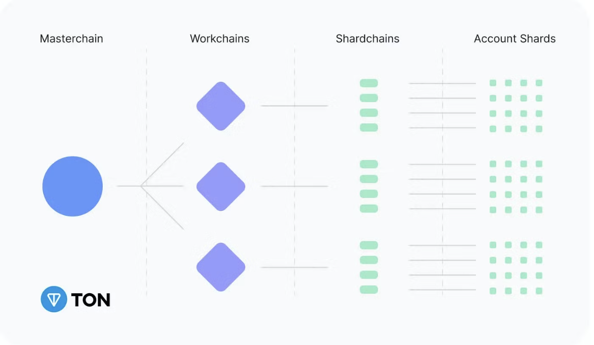
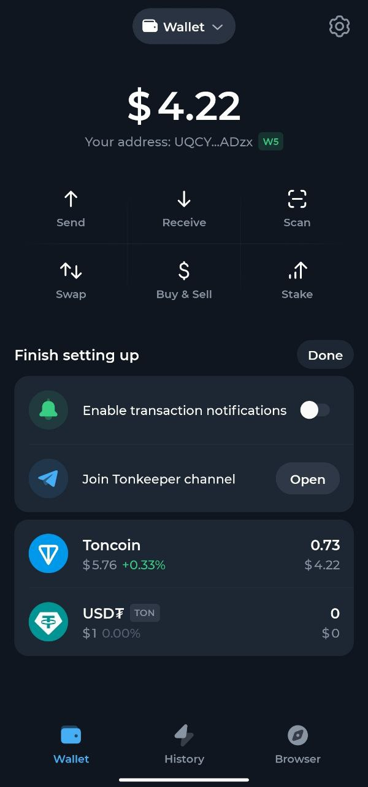
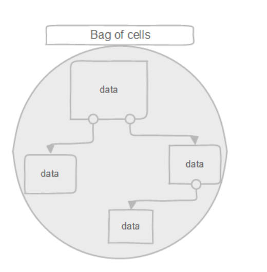
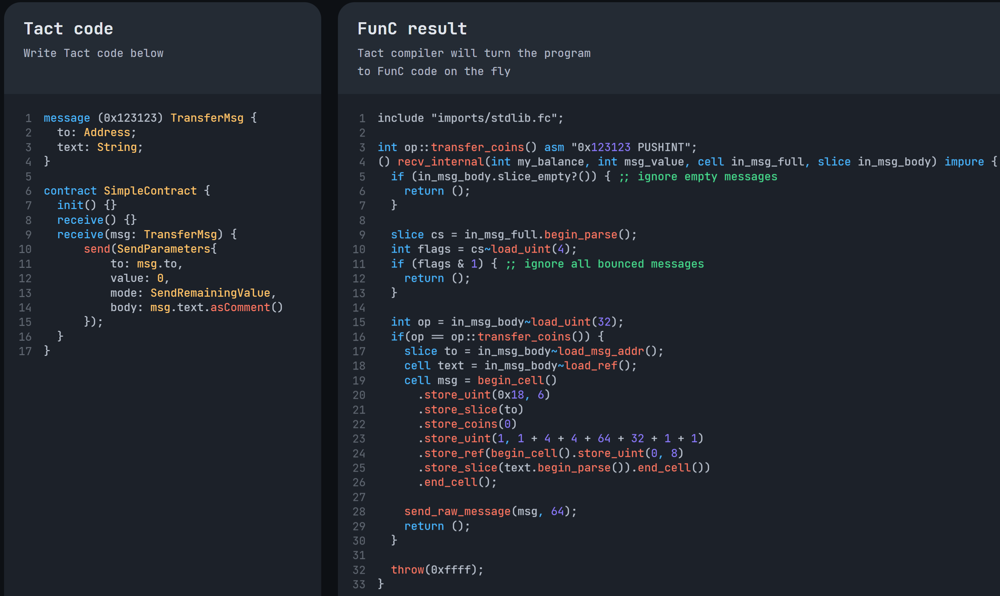

## TON 区块链架构

Ethereum 可以理解为单体应用，所有的数据都存在一个数据库中（一台电脑），所有的交易都是顺序执行。

TON 类似与一个微服务架构，使用分片技术(Sharding)，数据存储在不同的分片中（多台电脑），获取数据需要通过异步的消息传递，所有交易并行执行。

什么是分片技术 Sharding?

Sharding 技术主要是用来解决水平扩展的问题，垂直扩展可以理解为在一台电脑上加内存，cpu，硬盘等硬件，但这些目前都有瓶颈，不存在一台电脑能存储所有的数据，水平扩展可以让多台电脑协作存储相关的数据。水平扩展后每个 Shard 可以独立的接收查询和修改，可以减小系统负载，提升整体的负载能力。

TON Blockchain 会随着负载以及用户的增长，动态地拆分成多个Shardchain，如果生成的 Shardchain 依然负载较高，则可以继续拆分。当负载下降后多个 Shardchain 会合并（collapse）。系统保持 Shardchain 在一个合理的数量。  

理论上一个 workchain(=basechain)  可以有 2⁶⁰ 个 shardchains，一个 shardchain 至少需要一个 validator，目前有406 个 active validators，所以最多可以有 406 个 shardchain

启动一个 Workchain需要技术和经济支撑，还需要得到 2/3 的验证人的支持，当前设计支持最多 2³² 条 workchain，理论上一个 workchain 可以有 2⁶⁰ 个 shardchains



Masterchain 为所有链的源头：

- 存储区块链网络的配置信息
- 实现所有消息的一个路由功能，让消息可以在不同的 workchains, shardchain 之间进行传递
- 聚合所有 workchain 的数据，就数据层面来看类似 Ethereum L1，把 workchain 当 L2
- 所有活跃验证人信息，包括 stake 的信息


架构的变化导致合约的规则也跟着变化：

1. 合约需要支付租金，可以由开发者或者用户支付
2. 合约的 get method 只能由钱包应用发起调用，这里的钱包是指 Tonkeeper (metamask) 这样的的应用，不是钱包合约
3. 合约如果想调用其他合约的方法需要发送一个消息，接收方收到请求后会把结果返回，这个过程是异步的，也就是说发起了调用请求是不知道什么时候能收到响应结果的

## Everything is contract 钱包合约
Ethereum 上的账户分为 (EOA External Owned Account 私钥对应的公钥为EOA账户地址）和 Contract Account 两种类型，如果需要部署一个多签合约，需要使用第二种 Contract Account 来实现。

TON 的创新在于统一了账户的类型，所有的都是合约，每个公私钥可以对应 N 多个钱包地址，由于钱包是一个合约也给 TON 带来了超越 Ethereum 钱包的能力，比如说插件功能，可以实现以下的这些逻辑：

1. 交易的有效期，如果超过了，则交易为无效，不执行
2. 一个公私钥对应 N 个钱包地址，因为一个钱包就是一个合约而已，部署多个合约就可以有多个地址
3. 调用 Dapp 时自动把相关的手续费转给对应的合约
4. bounceable：反弹是合约的一种错误处理机制，当调用的合约不存在或者抛出错误时，如果交易设置为可反弹的，那么就会反弹回一个 bounced 消息给发起调用的合约。例如：用户发起一笔转账，如果调用过程出错了，那么就需要反弹消息，这样用户的钱包合约才能将自己的余额恢复。几乎所有在智能合约之间发送的内部消息都应该是可弹回的，即应该设置它们的“bounce”位。

钱包或合约的地址格式是 

| 1 字节: bounceable OR testnet | 1 字节: workchain id | 32 字节: account id | 2 字节: checksum |
```
 Mainnet:
  Bounceable:
    EQC0wbLt4Sqnb0pENTlEJYvMj5npx8R0cRoVLHi0MhjilkPX 
  Non-bounceable:
    UQC0wbLt4Sqnb0pENTlEJYvMj5npx8R0cRoVLHi0Mhjilh4S
Testnet:
  Bounceable:
    kQC0wbLt4Sqnb0pENTlEJYvMj5npx8R0cRoVLHi0Mhjilvhd
  Non-bounceable:
    0QC0wbLt4Sqnb0pENTlEJYvMj5npx8R0cRoVLHi0MhjilqWY
```

由于手机钱包UI的展示问题，所以容易被冒充相似地址的首尾进行攻击，所以操作一定要确认好地址，中间的才是真正的 account id，最前面的只是网络信息。


## 虚拟机(Virtual Machine)
EVM vs TVM 如何解释不同的虚拟机的指令？可以把VM理解为一个数据仓库且配备一个管理员，我们需要什么通过虚拟机指令与之沟通，进行数据的存储，获取，以及运算。每个虚拟机的指令系统都不一样，EVM支持的较少，TVM较多，也就意味着TVM能更高效的执行某些运算，举个例子：

假设 EVM 不支持幂函数，m^n，那么我们要运算的时候怎么操作？实际过程中我们会开辟一个空间来存储中间结果 m*m 进行 n 次相乘，得到最后的结果，也就是需要与虚拟机交互 n 次才能得出结果

TVM 因为支持幂函数，只需要告诉他 m 和 n，虚拟机就能直接返回结果。

### 数据结构
TON 链中使用 Cell 来表示数据结构，一个 Cell 可以存储不超过 1023 个 bit 的数据，此外可以保存最多 4 个 Cell 的 reference。


BoC 用于将 Cells 序列化成二进制，序列化的规则使用的是 TL-B 语言进行描述



```
## 后面表示多少个 bit 
{} 表示约束，也就是校验规则

serialized_boc#b5ee9c72 has_idx:(## 1) has_crc32c:(## 1) 
  has_cache_bits:(## 1) flags:(## 2) { flags = 0 }
  size:(## 3) { size <= 4 }
  off_bytes:(## 8) { off_bytes <= 8 } 
  cells:(##(size * 8)) 
  roots:(##(size * 8)) { roots >= 1 }
  absent:(##(size * 8)) { roots + absent <= cells }
  tot_cells_size:(##(off_bytes * 8))
  root_list:(roots * ##(size * 8))
  index:has_idx?(cells * ##(off_bytes * 8))
  cell_data:(tot_cells_size * [ uint8 ])
  crc32c:has_crc32c?uint32
  = BagOfCells;
```

## 汇编（Assembly） 

虚拟机本身只认识 0 1，我们对虚拟机的操作也只能有0 1来完成，直接对0和1编写程序就太困难了，于是有了汇编语言，它使用助记符来代替和表示虚拟机的各种指令。

比如我们想让 TVM 执行一个加法运算，则需要输入 10100000 (0xA0)，减法 10100001 (0xA1) 

Fift 就是 TVM 上的汇编语言，它是一门面向栈的编程模型，比如我们要计算 2+3 的结果

```
Fift可以写成
2 3 +

最终会把这段代码编译成下面的机器指令，交给虚拟机运行
0111 00000000 00000000 00000000 00000010
0111 00000000 00000000 00000000 00000011  
10100000

0111i=把i放入栈中，i为 uint4 占4个字节
```

EVM 里面的汇编：

```
PUSH1 0x02
PUSH1 0x03
ADD
60 02 60 03 01

最终会把这段代码编译成下面的机器指令，交给虚拟机运行
01100000 00000010
01100000 00000011
00000001

0x60=PUSH 0x01=ADD
```

## 合约开发语言
汇编语言仍然不适合用于业务代码开发，所以有了合约语言，用来编写合约的业务逻辑。

Ethereum 使用 Solidity，TON使用 FunC 进行合约开发

FunC 和 Solidity 都可以在语言内部直接使用汇编代码，来优化性能

```solidity
// FunC 
int add(int x, int y) asm "ADD";

// solidity
function add(uint a, uint b) {
  assembly {
    add(a,b)
  }
}
```

合约有两个入口，可以调用 recv_external 和 recv_internal，external 为从链外向链上发起的调用，比如 Tonkeeper 往链上发的交易，就是 recv_external，正常都是发送到钱包合约，钱包合约通过 internal 调用其他的合约（比如 stake 合约），钱包合约基本都是官方已经开发好了，所以我们开发的业务合约基本都是通过 recv_internal 来接收消息。

以下几种 recv_internal 的函数定义都是合法的，越少的参数的 gas 会更少
https://docs.ton.org/develop/func/functions#receive-internal

```
() recv_internal(int balance, int msg_value, cell in_msg_cell, slice in_msg) {}
() recv_internal(int msg_value, cell in_msg_cell, slice in_msg) {}
() recv_internal(cell in_msg_cell, slice in_msg) {}
() recv_internal(slice in_msg) {}

// 对于一个 Internal Message Body 里面的内容，也是使用 TL-B 进行描述
internal_transfer  query_id:uint64 amount:(VarUInteger 16) from:MsgAddress
                     response_address:MsgAddress
                     forward_ton_amount:(VarUInteger 16)
                     forward_payload:(Either Cell ^Cell) 
                     = InternalMsgBody;
```

FunC 没有 Bool 值，所有非0的数都认为是 true ，默认的 true = -1 (也就是 257 bit未都是1）

所以 if 判断时不使用 && 这种逻辑运算符，直接使用 & | ~ 这种位操作符

需要注意的点，**使用位操作符，连接两个条件时，要使用括号，调整优先级，不然默认会先进行位运算，然后进行比较运算**。

```
( int src_wc, int src_addr ) = parse_std_addr(src);
throw_unless(err::access_denied, (src_wc == chain::base) & (src_addr == wallet_addr));
```

由于 FunC 代码还是很复杂，最近出现了一个 Tact 编程语言，它是一种比 FunC 更高级的语言，使用起来更简单，且是有 TON 官方赞助的一个项目。

目前还没有太多项目使用，文档和教程都较少，代码最终需要编译成 FunC，早期阶段如果 Tact 生态还不够完善，直接用来开发可能面临在调试的时候还需要熟悉 FunC，随着生态的成熟，后面应该就能直接用 Tact 进行开发了。



## RPC 接口
Ethereum 使用 JSON-RPC 的方式进行描述，里面指定调用的方法，以及相关参数。

```
-> { "jsonrpc":"2.0", "id":64,
	"method":"web3_sha3",
	"params":["0x68656c6c6f20776f726c64"]
}

<- { "jsonrpc": "2.0", "id": 64,
  "result": "0x47173285a8d7341e5e972fc677286384f802f8ef42a5ec5f03bbfa254cb01fad"
}
```

TON 使用 TL 语言描述接口，目前 TON 所有的接口在这里 https://github.com/ton-blockchain/ton/tree/master/tl/generate/scheme

```
---types---
dht.pong random_id:long = dht.Pong;

---functions---
dht.ping random_id:long = dht.Pong;
```

## Jetton 代币开发
Jetton 是TON链的代币名称，跟以太坊的 Token 是一个意思，只是换了个词，应该是想跟以太坊区分开，还含有 TON 三个字符。

Jetton 的标准在 https://github.com/ton-blockchain/TEPs/blob/master/text/0074-jettons-standard.md 

以太坊的 Token 只需要一个合约就能完成，内部使用了一个账本记录所有 address ⇒ balance 的一个关系，这是一种无界的数据结构，因为只要地址不重复账本可以无限膨胀。

TON 不支持无界的数据结构，所以在设计合约时需要使用两个合约来完成：

1. Jetton Minter(Master) 
2. Jetton Wallet 

Jetton Minter 只会有一个，用来判断谁有权限 Mint，记录 totalSupply 和一些其他的 meta 数据，以及 Jetton Wallet 合约的代码。

Jetton Wallet 与用户的钱包合约没有任何关系，这里记录了 owner, balance, jetton_master_address, jetton_wallet_code 这些信息。通过该合约可以进行 send, receive 和 burn Jettons


合约部署地址的计算与以太坊 EIP 1014 类似，都是使用一个固定的算法，进行确定。

```javascript
// 以太坊 EIP 1014 合约地址生成算法
keccak256( 0xff ++ address ++ salt ++ keccak256(init_code))[12:]

// TVM 
hash(initial_code[合约代码], initial_state[账户 address])
```

所以只要知道了 Jetton Minter 和用户钱包的地址，就能得出他 Jetton Wallet 的地址。

## 参考链接

- https://learnblockchain.cn/article/8983
- https://blog.csdn.net/zhuqiyua/article/details/142063129
- https://blog.csdn.net/zhuqiyua/category_12760921.html
- https://medium.com/decipher-media/understanding-ton-and-tvm-bd13cc95ea1c
- https://foresightnews.pro/article/detail/61777
- https://docs.ton.org/develop/ethereum-to-ton/difference-of-blockchains
- https://docs.ton.org/learn/tvm-instructions/instructions
